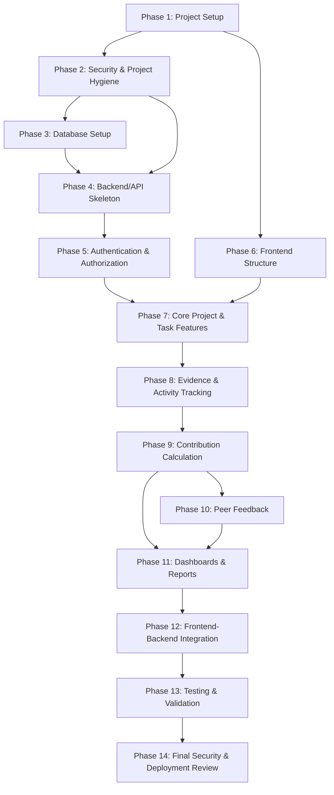

# FairShare Implementation Plan

This document outlines the phased, end-to-end implementation roadmap for **FairShare**, directly derived from the technical specifications ([`idea.md`](idea.md), [`architecture.md`](architecture.md), [`frontend.md`](frontend.md), [`backend.md`](backend.md), [`database.md`](database.md), [`api.md`](api.md)) and the finalized Stitch UI design system.

The implementation is broken into small, testable, and incrementally verifiable phases with clear prerequisites and dependency mappings.

---

## Roadmap Overview & Phase Dependencies



---

## Phase 1: Project Setup
- **Dependencies:** None
- **Objective:** Establish the foundational directory layout, package managers, and core development toolchains for both frontend and backend services.

1. **Repository Layout:**
   - Create root-level subdirectories: `frontend/` and `backend/`.
2. **Frontend Initialization:**
   - Initialize a modern Vite + React application (`npm create vite@latest frontend -- --template react`).
   - Install essential production libraries:
     - `react-router-dom` (routing)
     - `axios` (HTTP client)
     - `recharts` (data visualizations)
     - `lucide-react` (icons)
     - `@supabase/supabase-js` (direct storage/auth utilities)
3. **Backend Initialization:**
   - Initialize Python 3.10+ virtual environment (`venv`) inside `backend/`.
   - Create `requirements.txt` with locked dependencies:
     - `Flask`, `Flask-CORS`
     - `supabase`, `psycopg2-binary`
     - `python-dotenv`
     - `PyJWT`, `bcrypt`
     - `pydantic` or `marshmallow`
4. **Tooling & Code Quality:**
   - Configure ESLint and Prettier for React/JSX consistency.
   - Configure Flake8 and Black for Python backend formatting.

---

## Phase 2: Security & Project Hygiene
- **Dependencies:** Phase 1
- **Objective:** Establish defense-in-depth security standards and workspace safety before writing application business logic.

| Security Measure | Implementation Details | Target Location | Verification & Testing Method |
|---|---|---|---|
| **Git Ignore** | Configure files and folders to exclude from version control. | Root, `frontend/`, and `backend/` `.gitignore` | Run `git status` to ensure `.env`, `__pycache__`, `node_modules`, and `venv` are not tracked. |
| **Secrets Management** | Keep API keys, DB connection strings, and JWT secrets strictly out of source code. | `.env` file (local only) | Inspect commits and diffs to ensure no secrets or service keys are pushed. |
| **Environment Template** | Provide safe placeholder values for new developers. | `.env.example` in both `frontend/` and `backend/` | Verify a fresh clone can be configured using only the example files. |
| **Password Storage** | Hash passwords securely before database persistence. | Backend: `services/auth_service.py` using `bcrypt` | Inspect database directly to ensure plaintext passwords are never saved. |
| **Authentication Checks** | Validate JWT tokens on protected routes. | Backend: `middleware/auth_middleware.py` (`@require_auth`) | Make API requests without tokens and verify `401 Unauthorized` is returned. |
| **Authorization / Access Control** | Ensure users can only view and modify their own projects/tasks. | Backend: `routes/project_routes.py` and `routes/task_routes.py` | Attempt to access project details with a token for a non-member (expect `403 Forbidden`). |
| **Input Validation** | Validate and sanitize incoming JSON request bodies. | Backend: `utils/validators.py` using Pydantic | Send malformed payloads or missing required fields; expect `400 Bad Request`. |
| **Data Exposure Prevention** | Prevent sensitive fields (such as `password_hash`) from leaking in API responses. | Backend: Model serialization / route formatters | Inspect JSON responses on `/api/auth/me` and `/api/projects/<id>/members` to ensure hashes are omitted. |
| **Cross-Origin Resource Sharing (CORS)** | Restrict which client domains can invoke API endpoints. | Backend: `app.py` using `Flask-CORS` | Attempt requests from an unlisted browser origin and verify rejection. |
| **Safe File Uploads** | Securely handle file uploads (enforce file size limits and MIME type whitelists). | Backend: `/api/upload` route & Supabase Storage bucket policies | Attempt uploading an executable (`.exe`, `.sh`) or oversized file and verify rejection. |
| **Dev vs Prod Config** | Separate configurations across environments. | Backend: `config.py` driven by environment variables | Start app in production mode and verify debug logs/stack traces are silenced. |
| **Dependency Security** | Identify and mitigate known vulnerabilities in dependencies. | `requirements.txt` and `package.json` | Run `npm audit` and `pip-audit` to detect CVEs. |

---

## Phase 3: Database Setup
- **Dependencies:** Phase 2
- **Objective:** Provision the Supabase PostgreSQL database, execute DDL schemas, and set up storage buckets.

1. **Supabase Project Provisioning:**
   - Link project or configure environment connection parameters (`SUPABASE_URL`, `SUPABASE_KEY`).
2. **Schema Implementation:**
   - Run the DDL migrations defined in [`database.md`](database.md) to create tables:
     - `users`
     - `projects`
     - `project_members`
     - `project_invitations`
     - `tasks`
     - `evidence`
     - `activity_logs`
     - `peer_feedback` (with `CHECK (reviewer_id <> reviewee_id)` constraint)
     - `contribution_snapshots`
3. **Row-Level Security (RLS) & Views:**
   - Enable RLS on all tables and create policies for project member access.
   - Create the `v_peer_feedback_summary` view to ensure reviewer anonymity.
4. **Storage Bucket Configuration:**
   - Create Supabase Storage bucket `evidence_files`.
   - Apply access policies restricting uploads to authorized project members.

---

## Phase 4: Backend/API Skeleton
- **Dependencies:** Phase 2, Phase 3
- **Objective:** Build the modular Flask application factory, database connection singletons, and centralized error handling.

1. **App Factory:**
   - Set up `backend/app.py` with blueprint registration for `auth`, `projects`, `tasks`, `evidence`, `feedback`, and `analytics`.
2. **Database Connection:**
   - Initialize the Supabase client singleton in `services/supabase_service.py`.
3. **Middleware & Exception Handling:**
   - Implement `middleware/error_handler.py` to intercept HTTP exceptions and return standardized JSON error envelopes:
     ```json
     { "error": { "code": "ERROR_CODE", "message": "Human readable explanation" } }
     ```

---

## Phase 5: Authentication & Authorization
- **Dependencies:** Phase 4
- **Objective:** Implement user registration, password hashing, JWT token issuance, and protected route middleware.

1. **Auth Service & Routes (`routes/auth_routes.py`):**
   - `POST /api/auth/register`: Hashes password with bcrypt, creates user profile, and automatically resolves any pending invitations matching the user's email.
   - `POST /api/auth/login`: Verifies bcrypt password hash and generates signed JWT token.
   - `GET /api/auth/me`: Returns sanitized student profile data.
2. **Auth Middleware (`middleware/auth_middleware.py`):**
   - Create `@require_auth` decorator to parse HTTP `Authorization: Bearer <token>`, validate expiration and signature, and attach `g.current_user` to the request context.
3. **Verification:**
   - Unit test endpoints via automated test scripts or Postman/cURL.

---

## Phase 6: Frontend Integration (Stitch MCP Generated UI)
- **Dependencies:** Phase 1 *(Can proceed in parallel with Phases 3–5)*
- **Objective:** Integrate the pre-designed, high-fidelity frontend views and design system generated in Stitch MCP (`projects/5197296596430243910` - "FairShare").

1. **Design System & Token Integration:**
   - Integrate the approved **Accountable Academic** design system (`design.md` from Stitch):
     - Primary: Electric Indigo (`#4F46E5`), Secondary: Deep Teal (`#0D9488`), Warning: Warm Amber (`#F59E0B`), Neutral Slate (`#0F172A`).
     - Typography: Clean Inter hierarchy with tabular figures (`tnum`, `cv05`) for numeric metrics.
     - Spacing & Shapes: 8pt architectural rhythm, rounded borders (`8px` controls, `12px` cards, `9999px` pills), and ambient surface elevation tokens.
2. **Screen Integration from Stitch MCP (`FairShare` Project):**
   - **Landing Page (`FairShare - Landing Page`):** Screen `557a2101c6234b49be5bf36b69c37672` — Hero section, value propositions, side-by-side problem comparisons, and sample demo score slider.
   - **Global Dashboard (`FairShare - Global Dashboard`):** Screen `79a3bc55198549c8ac5da56316702512` — Active project cards, upcoming deadline alerts, and team activity streams.
   - **Project Workspace: Tasks (`FairShare - Project Workspace: Tasks`):** Screen `746de5c9bb4246219783ab908fa941b0` — Kanban & table views, task priority tags, and status transition workflows.
   - **Work Evidence Vault (`FairShare - Work Evidence Vault`):** Screen `a6600105435043bda4486352d5c500ee` — Artifact cards, filterable deliverable feeds (GitHub, Figma, Docs, Schematics), and submission modal.
   - **Contribution Dashboard (`FairShare - Contribution Dashboard`):** Screen `262de3c796d84e849d4a7cdf379d4a24` — 5-factor breakdown cards, Recharts horizontal team comparison, weekly progression trends, and *"Why did I get this score?"* explainer modal.
   - **Peer Feedback Modal (`FairShare - Peer Feedback Modal`):** Screen `74fa93ed267a46799fdbf01b14aeee90` — 6-dimension ratings form (1–5 scale) with anonymous submission and anti-self-review safeguards.
3. **Application Routing & Modular Component Structure:**
   - Configure React Router (`react-router-dom`) connecting the Stitch views:
     - `/` — `LandingPage`
     - `/login` & `/signup` — Authentication views
     - `/dashboard` — Global student overview
     - `/projects/new` — Create project wizard
     - `/projects/:id` — Project workspace with nested tabbed views (Tasks, Evidence Vault, Activity, Team)
     - `/projects/:id/contribution` — Contribution score dashboard & explainer modal
     - `/projects/:id/report` — Final printable audit report
4. **Context & HTTP Client:**
   - Set up Axios instance with request/response interceptors to automatically attach JWT bearer tokens and handle session expirations.
   - Implement `AuthContext` and `ProjectContext` for global application state.

---

## Phase 7: Core Project & Task Features
- **Dependencies:** Phase 5 (Backend), Phase 6 (Frontend)
- **Objective:** Enable creation and management of projects, team rosters, and deliverable tasks.

1. **Backend Project & Task APIs:**
   - `GET /api/projects`, `POST /api/projects`
   - `GET /api/projects/<id>`, `POST /api/projects/<id>/members`
   - `GET /api/projects/<id>/tasks`, `POST /api/projects/<id>/tasks`
   - `PUT /api/tasks/<id>`, `PATCH /api/tasks/<id>/status`
   - Enforce authorization: only verified project members can view or modify project tasks.
2. **Frontend Project Workspace Views:**
   - Build `DashboardPage.jsx` showing user's active projects, upcoming deadlines, and progress bars.
   - Build `CreateProjectPage.jsx` with multi-step flow for project metadata and teammate invitations.
   - Build `TaskBoard.jsx` with Kanban/List toggle, task priority badges, and status transition controls.
3. **Team Roster:**
   - Implement team members view displaying student names, assigned roles, and task completion tallies.

---

## Phase 8: Evidence & Activity Tracking
- **Dependencies:** Phase 7
- **Objective:** Provide tamper-proof activity logging and verifiable proof-of-work attachment (links and file uploads).

1. **Immutable Activity Logger:**
   - Implement `services/activity_logger.py` to record events into `activity_logs` whenever tasks are created, transitioned, or evidence is attached.
2. **Work Evidence Endpoints:**
   - `POST /api/upload`: Multipart upload to Supabase Storage with size and type validation.
   - `POST /api/tasks/<id>/evidence`: Attach link (GitHub, Figma, Google Docs) or uploaded artifact.
   - `GET /api/projects/<id>/evidence`: Retrieve all project evidence items.
3. **Frontend Evidence Vault & Feed:**
   - Implement `EvidenceList.jsx` to filter artifacts by type, task, or team member.
   - Implement `SubmitEvidenceModal.jsx` within the task workflow.
   - Implement `ActivityTimeline.jsx` displaying chronological, formatted team activity.

---

## Phase 9: Contribution Calculation Engine
- **Dependencies:** Phase 8
- **Objective:** Implement the transparent 5-factor scoring model with explainable breakdowns.

1. **Scoring Engine (`services/scoring_engine.py`):**
   - Calculate factors according to the defined weights:
     - Task Completion (30%)
     - Timeliness (20%, based on server timestamps)
     - Work Evidence (20%, tasks verified by artifacts)
     - Peer Feedback (20%, normalized teammate reviews)
     - Participation Activity (10%, engagement benchmark)
2. **Analytics Endpoints:**
   - `GET /api/projects/<id>/contribution/<user_id>`: Returns overall score and full factor breakdown payload.
   - `GET /api/projects/<id>/team-comparison`: Returns scores for all members.
   - `GET /api/projects/<id>/trends`: Returns weekly snapshot progression history.
3. **Snapshot Scheduler / Utility:**
   - Script to compute and store weekly historical checkpoints into `contribution_snapshots`.

---

## Phase 10: Peer Feedback System
- **Dependencies:** Phase 9
- **Objective:** Enable structured, anonymous peer evaluations across 6 dimensions with anti-gaming guards.

1. **Backend Feedback APIs (`routes/feedback_routes.py`):**
   - `POST /api/projects/<id>/feedback`: Accepts teammate evaluation (1–5 ratings across Participation, Responsibility, Quality, Collaboration, Communication, Timeliness).
   - Enforce anti-gaming constraint: block self-reviews (`reviewer_id != reviewee_id`).
   - `GET /api/projects/<id>/feedback/status`: Identifies which teammates the user has evaluated.
   - `GET /api/projects/<id>/feedback/summary`: Returns anonymized, aggregated category averages.
2. **Frontend Peer Review Modal:**
   - Build `PeerFeedbackModal.jsx` featuring 5-star / radio rating scales and constructive feedback text input.
3. **Scoring Integration:**
   - Recompute peer feedback contribution component using aggregated teammate ratings.

---

## Phase 11: Dashboards & Reporting
- **Dependencies:** Phase 9, Phase 10
- **Objective:** Provide rich data visualizations, explainability modals, and the downloadable final report.

1. **Frontend Contribution Dashboard (`ContributionPage.jsx`):**
   - Key metric cards (Score, On-Time Rate, Evidence Count, Peer Rating).
   - `ScoreFactorBreakdown.jsx`: Progress bars displaying weighted factor contributions.
   - `ScoreExplainerModal.jsx`: Explains *"Why did I get this score?"* with exact arithmetic.
   - `TeamComparisonChart.jsx`: Horizontal bar comparison across team members.
   - `ContributionTrendChart.jsx`: Progression line chart across weekly checkpoints.
2. **Final Contribution Report (`FinalReportPage.jsx`):**
   - Endpoint: `GET /api/projects/<id>/report` compiling project metrics and evidence manifest.
   - Clean, printable template with `@media print` styling and `window.print()` trigger.

---

## Phase 12: Frontend-Backend Integration
- **Dependencies:** All previous phases
- **Objective:** Wire all React views to live Flask APIs and validate complete end-to-end functionality.

1. **End-to-End API Integration:**
   - Connect all forms, modals, tables, and buttons to active backend endpoints.
2. **State & Reactive UI Validation:**
   - Confirm immediate UI updates when tasks change status, evidence is attached, or reviews are submitted.
3. **Seed Dataset Execution:**
   - Run `utils/seed_data.py` to populate the reference **Smart Water Management System** project:
     - Abhaas (Frontend Lead): 82%
     - Rohit (Backend Developer): 76%
     - Denesh (Hardware Engineer): 68%
     - Aditya (Documentation & QA): 61%

---

## Phase 13: Testing & Validation
- **Dependencies:** Phase 12
- **Objective:** Comprehensive testing of user journeys, score verification, and edge-case handling.

1. **End-to-End User Journey Tests:**
   - Complete project lifecycle walkthrough: registration -> project creation -> task assignments -> evidence submissions -> peer reviews -> report generation.
2. **Scoring Engine Validation:**
   - Verify calculation correctness against manual math for edge cases (zero tasks, late tasks, unrated members).
3. **UI/UX & Responsiveness:**
   - Verify layout responsiveness across desktop, tablet, and mobile screen sizes.
   - Validate form error displays, loading spinners, and empty states.

---

## Phase 14: Final Security & Deployment Review
- **Dependencies:** Phase 13
- **Objective:** Final hardening, production build preparation, and environment lockdown.

1. **Security Audit:**
   - Verify all Phase 2 checklist items against the final codebase.
   - Confirm CORS headers, token expiration, and SQL injection protections.
2. **Production Packaging:**
   - Configure WSGI production server (`waitress` for Windows / `gunicorn` for Linux) for Flask.
   - Compile production frontend bundle (`npm run build`).
3. **Environment Lockdown:**
   - Ensure debug flags are disabled (`FLASK_DEBUG=False`).
   - Secure and verify production Supabase keys and credentials.
