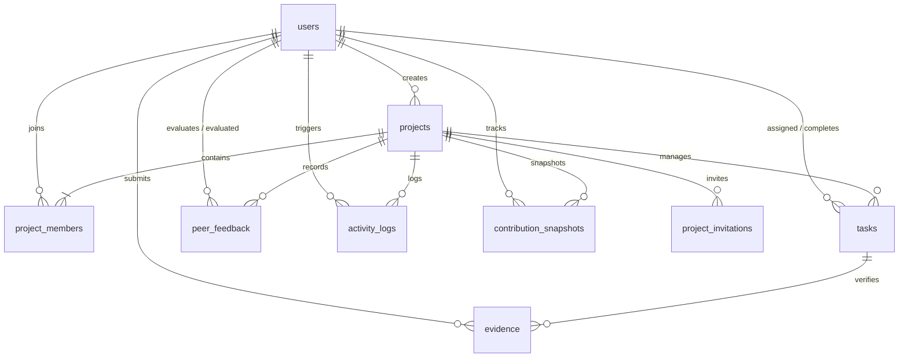

# FairShare
### *Making Every Contribution Count*

[](LICENSE)
[](Markdown%20files/frontend.md)
[](Markdown%20files/backend.md)
[](Markdown%20files/database.md)
[](Markdown%20files/backend.md)
[](Markdown%20files/architecture.md)

---

## 📌 Executive Summary & Problem Statement

In academic coursework, capstone engineering projects, and hackathon teams, **contribution levels frequently differ significantly, yet measuring them objectively has remained notoriously difficult**.

Conventional group grading suffers from the classic "free-rider" dilemma:
- Often, one or two proactive students carry the overwhelming majority of technical analysis, implementation, and problem-solving.
- Other team members contribute minimally or disengage, yet the entire group receives identical marks, recognition, or credit.
- When faculty or mentors attempt to evaluate individuals, they are forced to rely on subjective end-of-semester impressions, anecdotal claims, or contentious peer complaints.

**FairShare** bridges this gap by transforming project collaboration into a **visible, measurable, verifiable, and fair** process—without fostering toxic competition. By grounding evaluation in verifiable artifacts, tamper-proof activity tracking, and multi-dimensional peer evaluations, FairShare delivers a completely transparent, explainable **Contribution Score**.

> **Educational Integrity Note:** FairShare is an educational indicator designed to illuminate group collaboration dynamics. It is *not* an absolute measure of a student's intrinsic intelligence, technical ceiling, or human worth.

---

## 🏗️ System Architecture & Data Flow

FairShare is architected as a lightweight, modular Single Page Application (SPA) backed by a RESTful Flask service layer and a Supabase PostgreSQL database with object storage.

### High-Level Topology

```mermaid
graph LR
    subgraph Client ["Client Layer (Browser)"]
        UI["React 18 SPA (Vite)"]
        CTX["Context API (Auth & Project)"]
        CHART["Recharts Visualizations"]
    end

    subgraph Gateway ["API & Middleware Layer"]
        FLASK["Flask REST API (Python 3.10+)"]
        AUTH_MW["@require_auth (JWT Validator)"]
        ERR_MW["JSON Error Handler"]
        SCORER["Scoring Engine (services/scoring_engine.py)"]
    end

    subgraph Persistence ["Data & Cloud Layer (Supabase)"]
        PG[("PostgreSQL 15+ Relational DB")]
        RLS["Row-Level Security Policies"]
        STORAGE["Supabase Storage ('evidence_files' Bucket)"]
    end

    UI <-->|HTTP/REST & JSON via Axios| FLASK
    FLASK --> AUTH_MW
    FLASK --> SCORER
    FLASK <-->|supabase-py / psycopg2| PG
    FLASK <-->|Multipart File Uploads| STORAGE
    UI -.->|Direct Read Fallback (Optional)| RLS
```

### Architectural Principles:
1. **Server-Clock Authority:** Deadlines, task completions, and submission timestamps are captured strictly by the server clock to prevent client-side time tampering.
2. **Immutable Audit Trail:** Project actions generate append-only logs in `activity_logs`, guaranteeing a permanent historical record.
3. **Strict Peer Review Anonymity:** Direct reviewer identities are hidden from teammates through SQL views and backend data stripping (`v_peer_feedback_summary`).
4. **Self-Review Prevention:** Database-level check constraints (`CHECK (reviewer_id <> reviewee_id)`) block self-evaluations.

---

## 💡 Key Platform Capabilities

| Capability | Description | Core Artifact / Spec |
|---|---|---|
| 👥 **Team & Role Setup** | Project workspaces with assigned functional roles (e.g. *Frontend Lead*, *Backend Developer*, *Hardware Engineer*, *QA & Docs*). Auto-maps invitations upon registration. | [`idea.md`](Markdown%20files/idea.md) & [`backend.md`](Markdown%20files/backend.md) |
| 📋 **Verifiable Task Board** | Kanban and table views (`To Do`, `In Progress`, `Completed`) requiring verifiable proof of work before deliverables are credited. | [`frontend.md`](Markdown%20files/frontend.md) & [`api.md`](Markdown%20files/api.md) |
| 🗄️ **Work Evidence Vault** | Centralized repository for all attached deliverables: external links (GitHub PRs, Figma boards, Google Docs) and file uploads (PDFs, schematics, screenshots). | [`backend.md`](Markdown%20files/backend.md) & [`database.md`](Markdown%20files/database.md) |
| 📜 **Immutable Activity Stream** | Chronological, audit-ready timeline tracking milestone completions, status updates, and evidence submissions. | [`database.md`](Markdown%20files/database.md) |
| 🤝 **6-Dimension Peer Review** | Anonymous evaluations rated 1 to 5 across: *Participation*, *Responsibility*, *Quality of Work*, *Collaboration*, *Communication*, and *Timeliness*. | [`idea.md`](Markdown%20files/idea.md) & [`api.md`](Markdown%20files/api.md) |
| 🧮 **Explainable 5-Factor Scoring** | Mathematical contribution index calculated with 100% visibility via the *"Why did I get this score?"* breakdown modal. | [`backend.md`](Markdown%20files/backend.md) |
| 📈 **Weekly Progression Trends** | Time-series progression tracking (Weeks 1 through 4+) demonstrating sustained involvement versus last-minute rushes. | [`frontend.md`](Markdown%20files/frontend.md) |
| 📄 **Final Contribution Report** | Print-friendly (`@media print`), exportable audit summary detailing individual metrics, roster statistics, and deliverable manifests. | [`frontend.md`](Markdown%20files/frontend.md) & [`api.md`](Markdown%20files/api.md) |

---

## 🧮 The FairShare Scoring Engine

Every contribution score is 100% explainable, deterministic, and free of black-box heuristics.

### Mathematical Formulation

$$\text{Contribution Score} = \left(S_{\text{completion}} \times 0.30\right) + \left(S_{\text{timeliness}} \times 0.20\right) + \left(S_{\text{evidence}} \times 0.20\right) + \left(S_{\text{feedback}} \times 0.20\right) + \left(S_{\text{participation}} \times 0.10\right)$$

### Factor Breakdown & Normalization Rules

| Metric | Weight | Mathematical Definition | Explanation & Edge Cases |
|---|:---:|---|---|
| **Task Completion** ($S_{\text{completion}}$) | **30%** | $\min\left(100, \frac{\text{Completed Assigned Tasks}}{\max(1, \text{Total Assigned Tasks})} \times 100\right)$ | Proportion of assigned deliverables finalized. Defaults to team baseline if no tasks are assigned yet. |
| **Timeliness** ($S_{\text{timeliness}}$) | **20%** | $\frac{\text{Tasks where } (\text{completed\_at} \le \text{deadline})}{\max(1, \text{Total Completed Tasks})} \times 100$ | Measures on-time delivery based on server clock timestamps. Tasks marked complete after deadline reduce score. |
| **Work Evidence** ($S_{\text{evidence}}$) | **20%** | $\frac{\text{Completed Tasks with } \ge 1 \text{ Evidence Items}}{\max(1, \text{Total Completed Tasks})} \times 100$ | Verifiable accountability. Deliverables without external URLs or attached files receive 0% for this factor. |
| **Peer Feedback** ($S_{\text{feedback}}$) | **20%** | $\left(\frac{\text{Teammate Average Rating across 6 Dimensions}}{5.0}\right) \times 100$ | Normalized 1–5 teammate feedback. Defaults to 100% during early milestones before feedback windows open. |
| **Participation** ($S_{\text{participation}}$) | **10%** | $\min\left(100, \frac{\text{Verified User Logged Actions}}{\max(1, \max(\text{Team Avg Actions}, 20))} \times 100\right)$ | Quantifies consistent engagement in the shared activity stream relative to team activity benchmarks. |

### Interactive Explainability Payload
When a student clicks their score on the dashboard, the backend delivers the complete arithmetic explanation:

```json
{
  "user_id": "u1",
  "name": "Abhaas",
  "overall_score": 82,
  "breakdown": {
    "task_completion": { "score": 90.0, "weight": 30, "points": 27.0, "details": "Completed 18 out of 20 assigned tasks." },
    "timeliness": { "score": 85.0, "weight": 20, "points": 17.0, "details": "17 out of 20 tasks submitted on or before deadline." },
    "work_evidence": { "score": 80.0, "weight": 20, "points": 16.0, "details": "16 tasks backed by verified links or repository files." },
    "peer_feedback": { "score": 75.0, "weight": 20, "points": 15.0, "details": "Average 3.75 / 5.0 across 3 teammate evaluations." },
    "participation": { "score": 70.0, "weight": 10, "points": 7.0, "details": "Logged 21 verified project actions against team benchmark." }
  }
}
```

---

## 🗄️ Database Architecture & Relational Schema

FairShare uses Supabase PostgreSQL 15+ with strict relational integrity, cascade deletions, and index optimization.

### Entity-Relationship Diagram (ERD)



### Relational Table Summary

| Table | Primary Key | Foreign Keys | Key Constraints | Purpose |
|---|---|---|---|---|
| `users` | `id` (UUID) | None | `email UNIQUE` | Registered student profiles and credentials (bcrypt). |
| `projects` | `id` (UUID) | `created_by -> users(id)` | None | Project workspaces, dates, and categories. |
| `project_members` | `id` (UUID) | `project_id`, `user_id` | `UNIQUE(project_id, user_id)` | Team membership mapping and designated roles. |
| `project_invitations` | `id` (UUID) | `project_id`, `invited_by` | `UNIQUE(project_id, email)` | Pending teammate invitations claimed at signup. |
| `tasks` | `id` (UUID) | `project_id`, `assigned_to`, `completed_by` | Status & Priority `CHECK` | Deliverables, deadlines, statuses, and completion times. |
| `evidence` | `id` (UUID) | `task_id`, `user_id` | Type `CHECK` | Supporting proof-of-work URLs and storage paths. |
| `activity_logs` | `id` (UUID) | `project_id`, `user_id` | Append-Only | Immutable chronological stream of team actions. |
| `peer_feedback` | `id` (UUID) | `project_id`, `reviewer_id`, `reviewee_id` | `CHECK(reviewer_id <> reviewee_id)` | Teammate ratings (1–5) across 6 dimensions. |
| `contribution_snapshots` | `id` (UUID) | `project_id`, `user_id` | Score 0–100 `CHECK` | Weekly score snapshots powering progression line charts. |

---

## 🔌 Standardized REST API Catalog

All endpoints use JSON payloads and adhere to standard response envelopes. Detailed payload contracts are documented in [`api.md`](Markdown%20files/api.md).

| Category | Method | Endpoint | Auth | Description |
|---|---|---|:---:|---|
| **Auth** | `POST` | `/api/auth/register` | Public | Register student, claim pending invites, issue JWT |
| | `POST` | `/api/auth/login` | Public | Validate credentials and return JWT bearer token |
| | `GET` | `/api/auth/me` | Bearer | Retrieve authenticated student profile |
| **Projects** | `GET` | `/api/projects` | Bearer | List all projects belonging to active user |
| | `POST` | `/api/projects` | Bearer | Create project workspace and send teammate invitations |
| | `GET` | `/api/projects/<id>` | Bearer | Get project overview, stats, and member list |
| | `POST` | `/api/projects/<id>/members` | Bearer | Add or invite teammate to existing project |
| **Tasks** | `GET` | `/api/projects/<id>/tasks` | Bearer | List deliverables with assignee and evidence status |
| | `POST` | `/api/projects/<id>/tasks` | Bearer | Create new deliverable with priority and deadline |
| | `PUT` | `/api/tasks/<id>` | Bearer | Update task metadata or reassign owner |
| | `PATCH` | `/api/tasks/<id>/status` | Bearer | Update status (`In Progress`, `Completed` with server timestamp) |
| **Evidence** | `POST` | `/api/upload` | Bearer | Multipart upload to Supabase Storage bucket |
| | `POST` | `/api/tasks/<id>/evidence` | Bearer | Attach deliverable URL or uploaded file |
| | `GET` | `/api/projects/<id>/evidence` | Bearer | Retrieve all verified artifacts for project vault |
| **Feedback** | `POST` | `/api/projects/<id>/feedback` | Bearer | Submit anonymous 6-factor review (blocks self-review) |
| | `GET` | `/api/projects/<id>/feedback/status` | Bearer | Check which teammates active user has evaluated |
| | `GET` | `/api/projects/<id>/feedback/summary` | Bearer | Get anonymized, aggregated peer scores |
| **Analytics** | `GET` | `/api/projects/<id>/contribution/<uid>` | Bearer | Fetch 5-factor explainable score breakdown |
| | `GET` | `/api/projects/<id>/team-comparison` | Bearer | Retrieve relative scores across all members |
| | `GET` | `/api/projects/<id>/trends` | Bearer | Weekly score progression for time-series charts |
| | `GET` | `/api/projects/<id>/report` | Bearer | Compile comprehensive final audit summary |

---

## 🎨 Frontend Design System & UI Specifications

The FairShare frontend adheres to the **Stitch UI** design specification—crafted for student-friendly usability, high clarity, and trustworthy aesthetics.

### Color Tokens & Design Semantics

```css
:root {
  --color-primary: #4F46E5;        /* Indigo-600: Primary brand & active tabs */
  --color-primary-light: #EEF2FF;  /* Indigo-50: Badge fills & highlight cards */
  --color-primary-hover: #4338CA;  /* Indigo-700: Button hover states */
  --color-accent: #6366F1;         /* Indigo-500: Gradients & chart markers */
  --color-success: #10B981;        /* Emerald-500: Completed tasks & on-time badges */
  --color-success-bg: #ECFDF5;     /* Emerald-50: Success container backgrounds */
  --color-warning: #F59E0B;        /* Amber-500: Approaching deadlines & warnings */
  --color-warning-bg: #FFFBEB;     /* Amber-50: Notice banners */
  --color-danger: #EF4444;         /* Rose-500: Overdue tasks & missing evidence */
  --color-danger-bg: #FEF2F2;      /* Rose-50: Overdue badge backgrounds */
  --color-bg-main: #F8FAFC;        /* Slate-50: Neutral app body background */
  --color-bg-card: #FFFFFF;        /* Card & modal container surfaces */
  --color-border: #E2E8F0;         /* Slate-200: Dividers & input borders */
  --color-text-main: #0F172A;      /* Slate-900: Primary headers & text */
  --color-text-muted: #64748B;     /* Slate-500: Subtitles & timestamps */
}
```

### Application Route Map

| Path | Component | Auth Required | Purpose |
|---|---|:---:|---|
| `/` | `LandingPage.jsx` | No | Introduction, value proposition, problem comparison, sample demo |
| `/login` | `LoginPage.jsx` | No | Student credential authentication |
| `/signup` | `SignupPage.jsx` | No | Student onboarding with auto-invite claiming |
| `/dashboard` | `DashboardPage.jsx` | Yes | Global student dashboard: active projects, upcoming deadlines |
| `/projects/new` | `CreateProjectPage.jsx` | Yes | Project wizard: metadata, dates, team roster invitations |
| `/projects/:id` | `ProjectWorkspacePage.jsx` | Yes | Workspace tabs: Overview, Tasks, Evidence Vault, Activity, Team |
| `/projects/:id/contribution` | `ContributionPage.jsx` | Yes | Personal score breakdown, team comparison, progression charts |
| `/projects/:id/report` | `FinalReportPage.jsx` | Yes | Formal audit report with `@media print` export formatting |

---

## 🛡️ Anti-Gaming & Security Safeguards

To prevent score inflation, artificial activity spamming, or retaliation:

1. **Server Clock Authority:** Due dates, task completions, and log entries rely on PostgreSQL server time (`now()`), nullifying client clock spoofing.
2. **Strict Self-Review Prohibition:** Database-enforced check constraints prevent users from submitting evaluations for themselves.
3. **No Unverified Deliverables:** Marking a task as complete without attached evidence generates an amber `Evidence Missing` warning and assigns a 0% evidence rating for that task.
4. **Permanent Audit Trail:** Task assignments, status transitions, and file uploads are immutably preserved in `activity_logs`.
5. **Sanitized Outlier Moderation:** Peer evaluation averages are trimmed to prevent retaliatory low ratings or collusion.
6. **Defense-in-Depth Middleware:** JWT bearer tokens are strictly validated via `@require_auth` with project membership validation on every sensitive API request.

---

## 👥 Reference Prototype Case Study: Smart Water Management System

To facilitate immediate testing and presentation, FairShare is bundled with a pre-configured reference dataset:

**Project Details:**
- **Title:** `"Smart Water Management System"`
- **Category:** `"IoT & Full-Stack Engineering"`
- **Timeline:** August 1, 2026 – September 30, 2026

**Team Roster & Benchmark Scoring:**
| Member | Designated Role | Final Score | Tasks Completed | Evidence Verified | Peer Rating |
|---|---|:---:|:---:|:---:|:---:|
| **Abhaas** | Frontend Lead | **82%** | 18 / 20 (90%) | 16 Artifacts | 3.75 / 5.0 |
| **Rohit** | Backend Developer | **76%** | 15 / 19 (79%) | 13 Artifacts | 4.00 / 5.0 |
| **Denesh** | Hardware Engineer | **68%** | 11 / 16 (69%) | 9 Artifacts | 3.60 / 5.0 |
| **Aditya** | Documentation & QA | **61%** | 9 / 15 (60%) | 8 Artifacts | 3.40 / 5.0 |

**Weekly Progression Snapshots:**
| Student | Week 1 | Week 2 | Week 3 | Week 4 (Final) |
|---|:---:|:---:|:---:|:---:|
| **Abhaas** | 55% | 67% | 76% | **82%** |
| **Rohit** | 50% | 62% | 70% | **76%** |
| **Denesh** | 40% | 54% | 62% | **68%** |
| **Aditya** | 45% | 50% | 58% | **61%** |

---

## 📁 Repository Directory Structure

```text
FairShare/
├── README.md                          # Master documentation & project guide (you are here)
│
├── frontend/                          # React 18 Single Page Application
│   ├── index.html                     # HTML5 entry point
│   ├── package.json                   # Dependencies (React, Router, Recharts, Lucide, Axios)
│   ├── vite.config.js                 # Vite bundler configuration
│   └── src/
│       ├── main.jsx                   # React root bootstrap
│       ├── App.jsx                    # Application routing provider
│       ├── index.css                  # Stitch design tokens & utility styles
│       ├── context/                   # Global state (AuthContext, ProjectContext)
│       ├── services/                  # HTTP clients & API wrappers
│       ├── components/                # Reusable UI primitives (Modals, Badges, Cards)
│       └── pages/                     # Full-page route views
│
├── backend/                           # Flask REST API Microservice
│   ├── app.py                         # Application factory & blueprint registration
│   ├── config.py                      # Environment configuration loading
│   ├── requirements.txt               # Locked Python dependencies
│   ├── .env.example                   # Safe environment template
│   ├── routes/                        # Blueprints (auth, projects, tasks, evidence, feedback, analytics)
│   ├── services/                      # Business logic (scoring_engine, activity_logger, report_service)
│   ├── middleware/                    # @require_auth JWT validator & error handlers
│   └── utils/                         # Input validators & seed_data.py reference script
│
└── Markdown files/                    # Detailed technical specifications
    ├── idea.md                        # Conceptualization, UX philosophy, and anti-gaming
    ├── architecture.md                # System topology, communications, and components
    ├── frontend.md                    # Stitch UI design system, tokens, and component breakdown
    ├── backend.md                     # Flask REST architecture and scoring engine logic
    ├── database.md                    # Supabase PostgreSQL DDL, indexes, and RLS policies
    └── api.md                         # Standardized REST endpoint contracts and schemas
```

---

## 🚀 Quickstart & Developer Setup Guide

### 1. Prerequisites
- **Node.js:** v18.0+ & npm v9.0+
- **Python:** v3.10+
- **Supabase Account:** Access to a Supabase project (URL and API keys)

### 2. Backend Setup
```bash
# Navigate to backend directory
cd backend

# Create and activate Python virtual environment
python -m venv venv
# On Windows:
.\venv\Scripts\activate
# On Linux/macOS:
source venv/bin/activate

# Install dependencies
pip install -r requirements.txt

# Configure environment variables
cp .env.example .env
# Fill in SUPABASE_URL, SUPABASE_KEY, and JWT_SECRET

# Start Flask development server
flask run --port=5000
```

### 3. Frontend Setup
```bash
# Navigate to frontend directory
cd frontend

# Install Node dependencies
npm install

# Start Vite development server
npm run dev
```

### 4. Database Initialization & Seeding
1. Open your Supabase Dashboard SQL Editor and execute the schema script from [`database.md`](Markdown%20files/database.md).
2. Populate the reference demonstration dataset:
```bash
cd backend
python utils/seed_data.py
```

---

## 📚 Complete Documentation Index

For in-depth specifications, consult the dedicated documents in the [`Markdown files/`](Markdown%20files/) directory:

| Document | Topic & Focus |
|---|---|
| 📖 [**`idea.md`**](Markdown%20files/idea.md) | Product concept, user flow, UX transparency principles, and Design Thinking connection. |
| 🏗️ [**`architecture.md`**](Markdown%20files/architecture.md) | Client-server topology, data pipelines, permissions, and service boundary mappings. |
| 🎨 [**`frontend.md`**](Markdown%20files/frontend.md) | Stitch UI tokens, responsive layouts, component library, and chart specifications. |
| ⚙️ [**`backend.md`**](Markdown%20files/backend.md) | Flask architecture, 5-factor scoring engine math, routes, and activity logging. |
| 🗄️ [**`database.md`**](Markdown%20files/database.md) | PostgreSQL DDL definitions, relational constraints, performance indexes, and RLS rules. |
| 🔌 [**`api.md`**](Markdown%20files/api.md) | Request/response JSON schemas, authentication headers, and standard error codes. |

---

## 📄 License

This project is licensed under the MIT License - see the [LICENSE](LICENSE) file for details.
